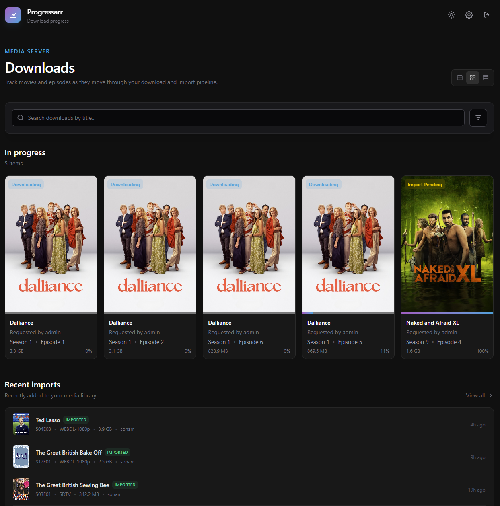
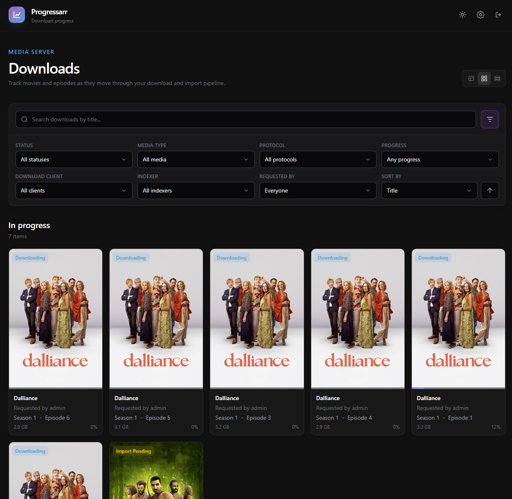
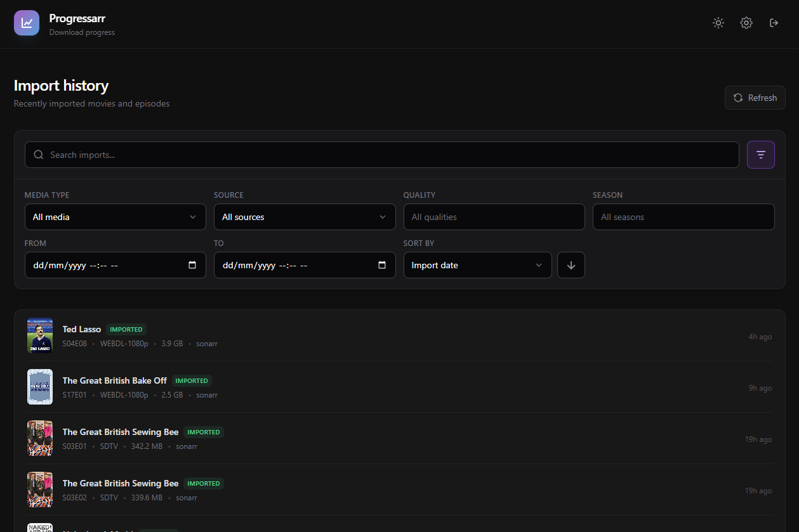
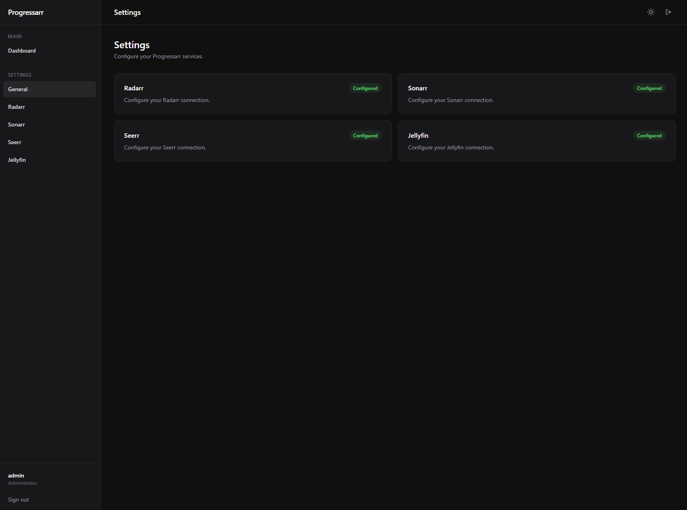

# Progressarr

> A unified dashboard for your *Arr media stack.

Progressarr is a lightweight, self-hosted dashboard that brings download activity, history, requests, and media-processing information together in one place.



Instead of jumping between multiple applications, Progressarr provides a single visibility layer across your media pipeline.

**Radarr → Download → Import → Jellyfin**

**Sonarr → Download → Import → Jellyfin**

Progressarr is designed to complement the tools that already do the heavy lifting rather than replace them.

---

## Features

- Unified download monitoring
- Download history
- Sonarr history
- Radarr history
- User-scoped requests and downloads
- Download status information
- Media and service metadata
- Search
- Advanced filtering
- Date/time filtering
- Sorting
- Jellyfin integration
- Seerr integration
- Session-based authentication
- Centralised service configuration
- Responsive UI
- Docker-first deployment

---

## Supported Services

| Service | Integration |
|---|---|
| Radarr | Movies, downloads, history, grabs, imports |
| Sonarr | Series, episodes, downloads, history, grabs, imports |
| Seerr | User requests |
| Jellyfin | Media-server information |
| SABnzbd | Download information |

Progressarr is designed so additional services can be integrated without tightly coupling their configuration to the rest of the application.

---

## Screenshots

Screenshots will be added as the UI continues to evolve.

### Dashboard


### History


### Settings



---

# Getting Started

The recommended way to run Progressarr is with Docker.

### Prerequisites

You will need:

- Docker
- Docker Compose
- A running Radarr instance
- A running Sonarr instance
- A running Seerr instance

Jellyfin is optional.

Progressarr is designed primarily for self-hosted environments.

### Quick Start

Add Progressarr to your existing Docker Compose stack:

```yaml
progressarr:
  image: ghcr.io/edwardemc/progressarr:latest
  container_name: progressarr
  ports:
    - ${VM_IP}:8181:8000
  volumes:
    - ../progressarr/data:/app/data
  networks:
    - media
  restart: unless-stopped
```

Then start the container:

```bash
docker compose up -d progressarr
```

Open Progressarr in your browser and complete the first-time setup.

For the complete installation and configuration guide, see [Getting Started](docs/GETTING_STARTED.md).

---

# First-Time Setup

When Progressarr is first opened, the setup screen guides you through the initial configuration.

The setup process:

1. Connects Progressarr to your Jellyfin server.
2. Creates the default administrator account.

Once setup is complete, configure your Radarr, Sonarr, and Seerr connections through **Settings**.

Users can log in using their existing Jellyfin account credentials. Administrators can additionally log in using the default administrator account created during setup.

---

# Docker Networking

When Progressarr is running on a shared Docker network, services should be configured using their Docker service/container name rather than the host IP address.

For example:

```text
http://jellyfin:8096
```

instead of:

```text
http://192.168.0.1:8096
```

This allows Docker's internal DNS to resolve the service directly over the shared network.

Progressarr and the services it communicates with must share a Docker network for this approach to work.

---

# Dashboard

Progressarr provides a central dashboard for monitoring media activity across the configured services.

The dashboard currently provides:

- Download overview
- Download history
- Sonarr history
- Radarr history
- User-scoped requests
- Download status information
- Media/service metadata
- Search
- Advanced filtering
- Sorting
- Date/time filtering

---

# Download Filtering

The download interface supports filtering across a number of download attributes.

The primary search control is displayed by default, while additional filters can be expanded when required.

Filters can be combined to narrow large download and history datasets.

---

# History

Progressarr processes historical activity from:

- Sonarr
- Radarr

History information can be used to understand what happened to downloads after they were grabbed, including processing and import activity.

History is scoped by user requests, meaning standard users only see relevant historical data while administrators can see all history.

---

# Authentication

Progressarr includes application-level authentication using session-based authentication.

The authentication system supports:

- Administrator sessions
- Standard user sessions
- Secure session cookies
- Protected API endpoints
- Login/logout functionality

Unauthenticated requests to protected endpoints are rejected.

---

# Service Configuration

Service configuration is stored centrally and can be bootstrapped from environment configuration.

Currently supported service configuration includes:

- Radarr
- Sonarr
- Seerr
- Jellyfin

The external media services remain the source of truth for media and download information.

---

# Architecture

Progressarr consists of two primary applications:

```text
┌─────────────────────────────┐
│           Browser           │
│                             │
│       Vue / TypeScript      │
└─────────────┬───────────────┘
              │
              │ HTTP / API
              ▼
┌─────────────────────────────┐
│       FastAPI Backend       │
│                             │
│  ┌───────────────────────┐  │
│  │ Authentication         │  │
│  │ Service Configuration  │  │
│  │ Download Processing    │  │
│  │ History Processing     │  │
│  │ API Routes             │  │
│  └───────────────────────┘  │
└─────────────┬───────────────┘
              │
       ┌──────┼─────────┬──────────┐
       │      │         │          │
       ▼      ▼         ▼          ▼
    Radarr  Sonarr   Jellyfin    Seerr
       │      │
       └──┬───┘
          │
          ▼
       SABnzbd
```

---

# Technology Stack

## Backend

- Python
- FastAPI
- SQLAlchemy
- SQLite
- Pydantic
- Pydantic Settings
- Uvicorn

## Frontend

- Vue 3
- TypeScript
- Vite
- Tailwind CSS
- Pinia
- Vue Router
- Vue I18n

## Deployment

- Docker
- Docker Compose
- Nginx/reverse-proxy compatible

---

# Project Structure

```text
Progressarr/
│
├── backend/
│   ├── app/
│   │   ├── auth/
│   │   ├── clients/
│   │   ├── routers/
│   │   ├── services/
│   │   ├── config.py
│   │   ├── database.py
│   │   ├── db_models.py
│   │   └── main.py
│   │
│   ├── Dockerfile
│   └── ...
│
├── frontend/
│   ├── src/
│   │   ├── api/
│   │   ├── components/
│   │   ├── views/
│   │   ├── router/
│   │   ├── stores/
│   │   └── ...
│   │
│   ├── Dockerfile
│   └── ...
│
├── docker-compose.yml
├── docs/
│   └── GETTING_STARTED.md
└── README.md
```

The exact structure may evolve as the project develops.

---

# Development

## Backend

From the backend directory:

```bash
python -m uvicorn app.main:app --reload
```

The `--reload` option automatically reloads the application when Python source files change.

## Frontend

Install dependencies:

```bash
npm install
```

Start the development server:

```bash
npm run dev
```

The frontend development server is provided by Vite.

---

# Docker Development

The recommended development environment is Docker Compose when working with the complete Progressarr/media stack.

Build the containers:

```bash
docker compose build
```

Start them:

```bash
docker compose up -d
```

Follow logs:

```bash
docker compose logs -f
```

Rebuild a specific service:

```bash
docker compose build backend
docker compose up -d backend
```

Stop the stack:

```bash
docker compose down
```

---

# Troubleshooting

## Progressarr cannot connect to Radarr or Sonarr

First check that the services are running:

```bash
docker compose ps
```

Then check the Docker networks:

```bash
docker network ls
```

If Progressarr and the *Arr services are running in different Docker networks, they may not be able to communicate using their service names.

Make sure the relevant containers share a Docker network.

## API returns `401 Unauthorized`

A `401` response generally means the request is not authenticated or a configured service API key is invalid.

Check:

1. The Progressarr session is valid.
2. The relevant service is reachable.
3. The configured API key is correct.
4. The service URL is correct.

## Configuration changes are not appearing

Progressarr bootstraps configuration during startup.

After changing environment variables, restart the application:

```bash
docker compose restart backend
```

If the application already has configuration stored in the database, existing configuration may take precedence over newly supplied environment variables.

## Database schema changes

When database models change during development, the local database may no longer match the current SQLAlchemy models.

For development environments where the database can safely be recreated:

```bash
docker compose down -v
docker compose up -d
```

**Warning:** Removing volumes deletes data stored in those volumes.

Do not use this command against a production database unless you intentionally want to destroy the stored data.

---

# Security

Progressarr is intended primarily for trusted/self-hosted environments.

When exposing Progressarr outside the local network:

- Use HTTPS.
- Protect the application behind a suitable reverse proxy where appropriate.
- Do not commit API keys to source control.
- Do not expose `.env` files.
- Use strong authentication credentials.
- Restrict access using your network or VPN infrastructure where possible.

API keys for Radarr, Sonarr, and Jellyfin should be treated as secrets.

---

# Roadmap

Progressarr is actively being developed.

Potential future improvements include:

- Additional *Arr integrations
- Improved download status tracking
- More detailed media statistics
- Enhanced history analysis
- Dashboard statistics
- More advanced filtering
- Improved caching
- Background synchronization
- Improved mobile UI
- More granular user permissions
- Additional authentication options
- Expanded Jellyfin integration
- Improved performance for very large histories

---

# Contributing

Contributions, bug reports, and feature suggestions are welcome.

Before submitting a pull request:

1. Keep changes focused.
2. Follow the existing project structure.
3. Keep backend and frontend responsibilities separated.
4. Avoid introducing unnecessary dependencies.
5. Test changes locally.
6. Update documentation when behaviour changes.

---

# License

Progressarr is licensed under the [MIT License](LICENSE).

---

## About Progressarr

Progressarr is designed to sit alongside an existing self-hosted media stack and provide a single, clean interface for understanding what is happening across the download and media-processing pipeline.

Instead of replacing the tools that already do the heavy lifting, Progressarr brings their information together into one dashboard.

**Radarr → Download → Import → Jellyfin**

**Sonarr → Download → Import → Jellyfin**

Progressarr provides the visibility layer across that workflow.
